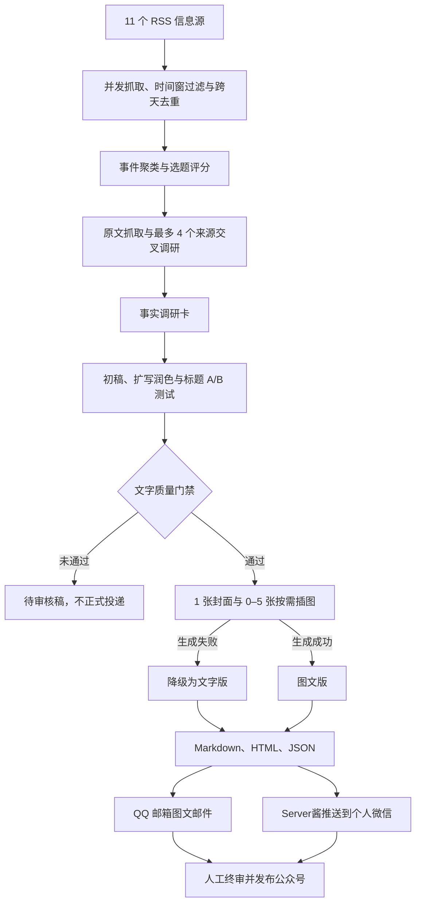

# ai-daily：AI 前沿公众号文章生产线

[](https://github.com/zhanghuaiwei/ai-daily/actions/workflows/ci.yml)
[](https://www.python.org/)
[](./LICENSE)
[](https://github.com/zhanghuaiwei/ai-daily/stargazers)

> 从 11 个 AI 信息源自动发现前沿话题，完成选题、交叉调研、中文写作、扩写润色、标题测试、去 AI 味、质量自检和可选配图，再将一题一文的公众号成品送到微信与 QQ 邮箱。

默认每天以 2 篇为目标，推荐发布 1–2 篇，硬上限 3 篇。质量不足时宁可少发：未通过文字质量门禁的内容只保留为待审核稿，不会被当作正式文章投递。

[快速开始](#快速开始) · [工作流程](#工作流程) · [配置说明](#配置说明) · [自动化部署](#部署到-github-actions) · [参与贡献](#参与贡献) · [MIT License](./LICENSE)

## 项目定位

`ai-daily` 是一个可自托管、可审计、无需常驻服务器的公众号编辑工作流。它适合希望持续追踪 AI 动态、减少资料整理和初稿编辑时间，同时保留最终人工审核权的个人作者或小型内容团队。

| 适合 | 不适合 |
|---|---|
| AI 前沿资讯、技术解读和行业观察 | 无来源支撑的批量洗稿 |
| 中文泛读者公众号文章 | 无人审核的高风险自动发布 |
| GitHub Actions 定时运行 | 要求完全离线运行的场景 |
| 使用 OpenAI 兼容文字接口 | 需要稳定公共 API 或多租户后台的产品 |

项目不会模拟登录公众号，也不会绕过平台权限。默认交付的是“可供人工终审的文章成品”，最终事实核验、版权判断和发布决定仍由使用者负责。

## 工作流程



每天北京时间 07:30 由 GitHub Actions 启动主流程。配图不是发布硬门槛：没有配图计划、未配置图像密钥或图像接口异常时，合格的文字文章仍会正常生成和投递。

## 核心能力

- **多源选题**：内置 Google DeepMind、arXiv、AI News、The Rundown、TechCrunch、The Verge、VentureBeat、MIT Technology Review、Hacker News 和中文源；单源失败不会中断整次任务。
- **一题一文**：同一事件先聚类，再为每个最终话题建立独立文章目录，避免把多条新闻拼成信息流水账。
- **证据约束写作**：原文调研形成带来源编号的事实、来源方说法、合理推断和不确定项；具体事实需能回溯到证据。
- **完整编辑链**：调研卡 → 初稿 → 扩写润色 → 过渡段整理 → 去 AI 味 → 终审，不直接发布一次生成结果。
- **标题与摘要**：每篇产生 3–5 个不同角度的标题候选并评分，同时生成公众号摘要。
- **中文优先**：普通概念不机械附带英文解释，只保留模型名、论文名、API、代码等必要技术术语。
- **质量门禁**：检查篇幅、中文比例、引用覆盖、文章结构、标题质量、常见 AI 套话和模型终审结果。
- **内容型配图**：尝试生成 1 张 900×383 封面和 0–5 张 1200×800 正文插图；插图脚本来自对应章节，而不是通用机器人背景图。
- **柔性降级**：文字接口失败时输出不可发布的资料预览；图像接口失败时保留可发布的文字版；微信或邮箱未配置时仍保留仓库产物。
- **多格式产物**：同时生成公众号 HTML、Markdown 和机器可读 JSON，便于复制发布、二次编辑、归档和扩展。
- **双通道投递**：Server酱负责个人微信提醒与正文，QQ SMTP 邮件使用内嵌图片，不依赖公网图片地址。
- **生命周期管理**：双周清理过期输出和带项目标记的 QQ 邮件，不按标题模糊匹配，也不触碰普通邮件。
- **安全边界**：RSS 和模型输出均按不可信数据处理；链接、HTML、Markdown 和模型结构化输出都会经过约束与净化。

## 快速开始

### 1. 环境要求

- Python 3.11 或更高版本
- 可访问 RSS 源的网络
- 用于生成正式文章的 OpenAI API key（默认模型为 GPT-5.6 Terra）
- 可选：图像生成 API、Server酱 Turbo SendKey、QQ 邮箱授权码

### 2. 安装

```bash
git clone https://github.com/zhanghuaiwei/ai-daily.git
cd ai-daily

python3 -m venv .venv
source .venv/bin/activate
python -m pip install -r requirements.lock

cp .env.example .env
```

Windows PowerShell 激活虚拟环境时使用：

```powershell
.venv\Scripts\Activate.ps1
```

### 3. 首次运行

先执行不调用大模型的安全预览：

```bash
python -m src.pipeline --dry-run --window-hours 72
```

预览会写入 `output-dryrun/<北京时间日期>/`，内容始终标记为不可发布。确认 RSS 抓取与模板渲染正常后，在 `.env` 中至少填写一个文字模型供应商的 API Key，再执行正式流程：

```bash
python -m src.pipeline --articles 2 --target-chars 2000
```

正式产物写入 `output/<北京时间日期>/`。命令只负责生成文章；本地投递可以分别调用 `src.email_delivery` 和 `src.delivery`，日常使用更推荐交给 GitHub Actions。

## 配置说明

将 `.env.example` 复制为 `.env` 用于本地运行；部署到 GitHub 后，将工作流需要的配置保存到仓库的 **Settings → Secrets and variables → Actions**。不要提交真实密钥。

| 变量 | 使用位置 | 必需 | 默认值或未配置行为 | 用途 |
|---|---|---:|---|---|
| `LLM_PROVIDER_ORDER` | 本地、Actions Variables | 否 | `gpt,deepseek,workbuddy,qwen` | 文字模型优先级；千问始终被移动到最后作为兜底 |
| `LLM_API_KEY` | 本地、Actions | 至少一个文字 Key | 缺失时跳过 GPT | OpenAI API key；兼容旧版配置 |
| `LLM_BASE_URL` | 本地、Actions | 否 | `https://api.openai.com/v1` | OpenAI API 地址 |
| `LLM_MODEL` | 本地、Actions | 否 | `gpt-5.6-terra` | 默认使用兼顾文章质量和成本的 [GPT-5.6 Terra](https://developers.openai.com/api/docs/models/gpt-5.6-terra) |
| `LLM_REASONING_EFFORT` | 本地、Actions | 否 | `medium` | GPT-5.6 推理强度：`none`、`low`、`medium`、`high`、`xhigh` 或 `max` |
| `DEEPSEEK_API_KEY` | 本地、Actions | 否 | 缺失时跳过 | DeepSeek API key |
| `DEEPSEEK_BASE_URL` / `DEEPSEEK_MODEL` | 本地、Actions | 否 | `https://api.deepseek.com` / `deepseek-v4-pro` | DeepSeek 兼容接口与模型 |
| `WORKBUDDY_API_KEY` | 本地、Actions | 否 | 缺失时跳过 | WorkBuddy 所用腾讯云 TokenHub API key，不是桌面端登录凭据 |
| `WORKBUDDY_BASE_URL` / `WORKBUDDY_MODEL` | 本地、Actions | 否 | Token Plan 个人版地址 / `hy3` | 按实际 TokenHub 套餐覆盖 |
| `QWEN_API_KEY` | 本地、Actions | 建议配置 | 缺失时无法执行最终兜底 | 阿里云百炼 API key；也兼容本地变量 `DASHSCOPE_API_KEY` |
| `QWEN_BASE_URL` / `QWEN_MODEL` | 本地、Actions | 否 | 北京共享域名 / `qwen3.8-max` | 千问兼容接口与兜底模型；其他地域必须覆盖地址 |
| `IMAGE_API_KEY` | 本地、Actions | 否 | 缺失时继续输出文字版 | 封面和正文插图生成 |
| `IMAGE_BASE_URL` | 本地、Actions | 否 | `https://api.openai.com/v1` | 图像接口地址 |
| `IMAGE_MODEL` | 本地、Actions | 否 | `gpt-image-2` | 图像模型名称 |
| `IMAGE_QUALITY` | 本地 | 否 | `medium` | `low`、`medium` 或 `high`；Actions 修改需同步调整工作流环境变量 |
| `WECHAT_SENDKEY` | 本地、Actions | 否 | 缺失时跳过微信投递 | Server酱 Turbo SendKey |
| `QQ_EMAIL_USER` | 本地、Actions | 否 | 缺失时跳过 QQ 投递和清理 | 完整 QQ 邮箱地址 |
| `QQ_EMAIL_AUTH_CODE` | 本地、Actions | 否 | 缺失时跳过 QQ 投递和清理 | SMTP/IMAP 授权码，不是登录密码 |
| `EMAIL_TO` | 本地、Actions | 否 | 默认发送给 `QQ_EMAIL_USER` | 邮件收件地址 |
| `PUBLIC_ASSET_ROOT_URL` | Actions | 否 | 使用提交后的 GitHub 原始文件地址 | 私有仓库中的公开图片根地址 |

文字模型默认按 `GPT → DeepSeek → WorkBuddy/TokenHub → 千问` 调用。缺少 Key 的供应商会被跳过；额度不足、限流、鉴权失败、模型不可用或连接失败时会记录原因并切换下一家。同一次运行中已经确认不可用的供应商会被熔断，避免选题、调研、写作和终审阶段重复消耗重试时间。千问固定为最后一层，所有模型都失败时才生成不可发布资料卡。

[DeepSeek](https://api-docs.deepseek.com/) 和[千问](https://help.aliyun.com/en/model-studio/compatibility-of-openai-with-dashscope)均使用供应商官方的 OpenAI 兼容接口；WorkBuddy 是桌面客户端，本项目实际接入的是其使用的[腾讯云 TokenHub API](https://cloud.tencent.com/document/product/1823/130119)。订阅桌面产品不等于已经拥有后端 API Key，请以各平台控制台生成的 Key 为准。

## 部署到 GitHub Actions

完整的逐步说明、验证点和故障排查见 [DEPLOY.md](./DEPLOY.md)。开源使用者推荐按下面方式部署：

1. Fork 本仓库，或将代码推送到自己的 GitHub 仓库。
2. 在 Actions Secrets 中配置文字模型密钥；图像、微信和 QQ 邮箱配置均可按需启用。
3. 在 **Actions → AI Daily Digest → Run workflow** 手动运行一次。
4. 确认日志、`output/<日期>/` 产物以及所配置的投递渠道无误。
5. 保持 Actions 启用，之后主流程每天北京时间 07:30 自动运行。

仓库包含三个工作流：

| 工作流 | 触发方式 | 作用 |
|---|---|---|
| `CI` | push、pull request | Python 编译、Ruff 静态检查和测试 |
| `AI Daily Digest` | 每天 07:30、手动 | 生成文章、提交产物、QQ/微信投递 |
| `Biweekly Article Cleanup` | 每周一 03:20 检查、手动 | 按至少 14 天间隔执行过期清理 |

> GitHub 原始文件地址只能直接用于公开仓库。私有仓库若要在微信中显示图片，请将 `output/` 同步到公开 HTTPS 存储，并配置 `PUBLIC_ASSET_ROOT_URL`。

## 产物结构

```text
output/YYYY-MM-DD/
├── digest.md                    # 当日选题总览
├── digest_wechat.html           # 总览的公众号 HTML
├── digest.json                  # 总览机器数据
├── articles.json                # 标题测试、评分和文章索引
├── article-01/
│   ├── article.md               # 独立文章 Markdown
│   ├── article_wechat.html      # 可复制到公众号编辑器的内联样式 HTML
│   ├── article.json             # 调研卡、正文、终审、指标和配图状态
│   └── images/
│       ├── cover.jpg            # 可选封面
│       └── illustration-*.jpg   # 0–5 张可选正文插图
└── article-02/
    └── ...
```

`article.json` 中的 `publishable` 是投递依据。`false` 表示文章未通过文字质量门禁，只能作为资料或人工编辑起点；`visuals.status` 记录配图是否成功，它本身不会决定文字文章能否发布。

## 人工发布流程

1. 在微信或 QQ 邮箱通读收到的文章，重点核对事实、数字、标题、来源和可能的版权风险。
2. 打开 `output/<日期>/article-XX/article_wechat.html`。
3. 浏览器全选复制，粘贴到公众号编辑器。
4. 如果编辑器没有带入本地图片，按原位置上传 `images/` 中对应文件。
5. 使用 `images/cover.jpg` 作为封面，完成预览并人工发布。

## 双周清理策略

清理任务采用白名单思路，避免把“定期清理”变成误删工具：

| 范围 | 自动处理 | 明确不处理 |
|---|---|---|
| `output/` | 删除 14 天保留期之外、名称严格匹配 `YYYY-MM-DD` 的普通目录 | 非日期目录、文件、符号链接和异常路径 |
| QQ 邮箱 | 删除收件箱和服务器“已发送”目录中，超过保留期且含 `X-AI-Daily: article` 专用邮件头的邮件 | 普通邮件、无项目标记的历史邮件 |
| 微信 | Server酱正文按服务商规则自动过期 | 微信客户端里的消息卡片无法由本项目远程删除 |

工作流每周检查一次，`.maintenance/cleanup-state.json` 保证实际清理间隔不少于 14 天；失败后可在下一周重试。首次启用或修改规则后，建议在 Actions 页面手动选择 `dry_run` 预览。

本地预览命令：

```bash
python -m src.cleanup --dry-run --force
```

## 常用命令

```bash
# 默认：最近 36 小时、目标 2 篇、每篇约 2000 字
python -m src.pipeline

# 周末或节假日扩大信息窗口
python -m src.pipeline --window-hours 72

# 每日 1 篇，目标约 1600 字
python -m src.pipeline --articles 1 --target-chars 1600

# 回看 14 天进行跨天去重；设为 0 可关闭
python -m src.pipeline --history-days 14

# 查看全部参数
python -m src.pipeline --help
python -m src.cleanup --help
```

参数边界：`--articles` 为 1–3，`--target-chars` 为 1200–3500，`--window-hours` 必须大于 0。

## 自定义

- **信息源**：修改 `config/sources.yaml`，无需改代码。
- **选题标准**：修改 `src/curator.py` 中的选题提示词和评分约束。
- **写作风格与门禁**：修改 `src/writer.py` 中的调研、写作、终审提示词及 `article_metrics`。
- **配图风格**：修改 `src/illustrator.py`，或设置 `IMAGE_QUALITY=low|medium|high`。
- **公众号排版**：修改 `templates/article.html`；样式使用内联 CSS 以适配复制粘贴。
- **发布时间**：同时调整 `.github/workflows/daily-digest.yml` 中的 `cron` 和 `timezone`。
- **清理策略**：调整 `.github/workflows/biweekly-cleanup.yml` 的保留期和最小执行间隔。

## 项目结构

```text
ai-daily/
├── .github/workflows/            # CI、每日生产、双周清理
├── config/sources.yaml           # RSS 信息源
├── src/
│   ├── fetcher.py                # RSS 并发抓取、重试和去重
│   ├── curator.py                # 事件聚类、选题和模型请求
│   ├── researcher.py             # 原文抓取与证据包
│   ├── writer.py                 # 调研卡、写作、润色和质量门禁
│   ├── illustrator.py            # 可选封面与插图
│   ├── renderer.py               # Markdown、HTML、JSON 渲染
│   ├── delivery.py               # Server酱微信投递
│   ├── email_delivery.py         # QQ SMTP 图文邮件
│   ├── cleanup.py                # 输出和 QQ 邮箱保留策略
│   ├── history.py                # 跨天去重
│   ├── safety.py                 # 文本、URL 和输出安全边界
│   └── pipeline.py               # 主入口
├── templates/                    # 公众号 HTML 模板
├── tests/                        # 自动化测试
├── .env.example                  # 本地配置模板
├── DEPLOY.md                     # 部署与运维手册
└── LICENSE                       # MIT License
```

## 开发与测试

```bash
python3 -m venv .venv
source .venv/bin/activate
python -m pip install -r requirements-dev.lock

python -m compileall -q src tests
ruff check src tests
python -m pytest
```

所有 push 和 pull request 都会执行同样的 CI 检查。提交涉及抓取、清理、安全净化或投递逻辑的改动时，请同时增加对应测试；外部服务测试应使用替身对象，不能依赖真实密钥。

## 参与贡献

Issue 和 pull request 都欢迎。适合优先参与的方向包括：

- 增加稳定、可信的一手 AI 信息源；
- 改进中文文章质量评估和可复现的评测样本；
- 优化跨源事件聚类、事实冲突识别与引用覆盖；
- 增加可选投递渠道或公开图片存储适配器；
- 改进公众号排版、无障碍文本和图片说明；
- 修复安全、隐私、性能或稳定性问题。

建议贡献流程：

1. 先搜索现有 [Issues](https://github.com/zhanghuaiwei/ai-daily/issues)，避免重复。
2. Fork 仓库，从 `main` 创建语义清晰的分支。
3. 保持改动聚焦，并为行为变化补充测试和文档。
4. 在本地运行编译、Ruff 和测试。
5. 提交 pull request，说明问题、方案、验证方式和潜在兼容性影响。

提交新信息源时，请说明来源性质、RSS 地址、更新频率和选择理由。修改提示词时，最好附带修改前后的同一批输入对比，避免只凭单篇文章判断效果。

## 安全与隐私

- `.env` 已被 Git 忽略；所有线上凭据只能放 GitHub Actions Secrets。
- 不要使用 QQ 登录密码，必须使用可撤销的 SMTP/IMAP 授权码。
- `WECHAT_SENDKEY` 等同消息推送权限，泄露后应立即在服务商后台重置。
- 微信投递会将最终 Markdown 发送给 Server酱；不接受这条数据路径时，不要配置 `WECHAT_SENDKEY`。
- `output/` 会被工作流提交到仓库。公开仓库意味着文章正文、来源和生成图片也公开可见。
- 图像生成会产生额外费用，建议在模型服务商后台设置预算和用量告警。
- 本项目不能替代人工事实核验、版权审查或平台合规判断。

如果发现可能导致凭据泄露、任意文件删除或不安全内容注入的漏洞，请不要在公开 Issue 中粘贴密钥、个人数据或可直接利用的细节；可先通过仓库维护者公开资料联系，并在修复后再披露。

## FAQ

<details>
<summary>为什么不直接全自动发布到公众号？</summary>

项目有意保留人工终审步骤，不调用公众号草稿或发布接口，也不模拟登录。这样可以在公开发布前检查事实、版权、排版和内容风险。
</details>

<details>
<summary>没有文字模型密钥可以运行吗？</summary>

可以运行 `--dry-run` 检查抓取、选题兜底、目录和模板，但结果始终不可发布。正式文章需要配置兼容接口的 `LLM_API_KEY`。
</details>

<details>
<summary>为什么当天没有收到正式文章？</summary>

当天可能没有话题通过事实、篇幅、中文比例、引用和模型终审门禁。系统会保留待审核资料，但不会为了凑数量把它当作成品投递。配图失败不会导致文字文章被拦截。
</details>

<details>
<summary>为什么文章没有配图？</summary>

配图是增强项。检查 `IMAGE_API_KEY`、账户余额、图像模型权限以及 `article.json` 中的 `visuals.status` 和 `visuals.error`。没有有价值的可视化内容时，模型也可以规划 0 张正文插图。
</details>

<details>
<summary>微信里为什么看不到图片？</summary>

默认图片地址来自提交后的 GitHub 文件，仓库必须公开。私有仓库需要把 `output/` 同步到公开 HTTPS 存储，并设置 `PUBLIC_ASSET_ROOT_URL`；路径结构应为 `日期/article-XX/images/文件名`。
</details>

<details>
<summary>如何配置 QQ 邮箱？</summary>

登录 [QQ 邮箱](https://mail.qq.com)，开启 IMAP/SMTP 并生成授权码。将邮箱地址保存为 `QQ_EMAIL_USER`，授权码保存为 `QQ_EMAIL_AUTH_CODE`。项目通过 `smtp.qq.com:465` 加密发送，并通过 `imap.qq.com:993` 清理带专用标记的过期项目邮件。
</details>

<details>
<summary>某个 RSS 源一直失败怎么办？</summary>

先在日志中搜索 `[FAIL]`。单个来源失败会自动隔离，不影响其他来源；RSSHub 公共实例不稳定时，可以替换实例或自行部署 RSSHub。
</details>

## License

本项目使用 [MIT License](./LICENSE)，允许使用、复制、修改、分发和商用，但须保留原许可证和版权声明。

如果这个项目对你有帮助，欢迎点一个 Star，也欢迎用 Issue 或 PR 分享你的信息源、评测方法和改进方案。
